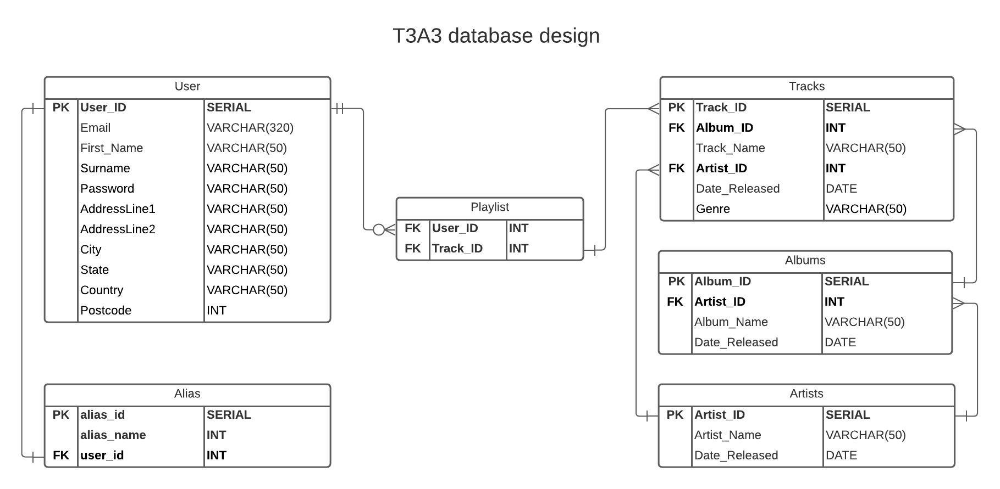

# T3A3 - Implement a System with Data and Application Layers.

This program is a class assessment completed to progress in my course. This is not a fully functioning deployable application. Time was limited so the program is made up of components to complete the requirements of the assessment only.

This assessment is a python server-side web application that takes advantage of the flask framework and its components to build a web application. It is inspired by spotify and I have tried to build a database to represent the main components that I think spotify would have as illustrated in the diagram below.

### Endpoints API:

##### User:

begin with: localhost:5000/user

|Endpoint|Application|
|---|---|
|/|Query all saved data for all users|
|/login|Login into the server and get a JWT token|
|/id|Find details on the user with the matching ID|
|/create|Creates a new user|
|/update/id|Update details of the user matching the ID|
|/delete/id|Delete a user|

##### Tracks:

begin with: localhost:5000/tracks

|Endpoint|Application|
|---|---|
|/|Get all tracks|

##### Playlist:

begin with localhost:5000/tracks

|Endpoint|Application|
|---|---|
|/id|Get the playlist of the user with the id number|
|/add_track|Add tracks to your personal playlist. You will need to be signed in with a JWT token|
|/delete_track|Remove the track from the playlist|

##### Artist:

begin with localhost:5000/artist

|Endpoint|Application|
|---|---|
|/Highest_profit|Find the artist with the highest profit|
|/Lowest_profit|Find the artist with the lowest profit|
|/Average_profit|Find the average profit of all the artist|
|/Sum_profit|Sum all the profit of all the artist|
|/Ordering|Application|
|/filtering|Finds all the artist that earn less then $40 million|
|/id/Albums|Find all the albums that the artist created|
|/id/Tracks|Find all the tracks that the artist created|

##### Albums:

begin with localhost:5000/albums
|Endpoints|Application|
|---|---|---|
|/id|Get all information in the database related to the album|
|/update/id|Update the details of the album with the matching id number|
|/id/tracks|Get all tracks the are on the album|

### Installation instructions:

|Instruction|command|
|---|---|
|||

