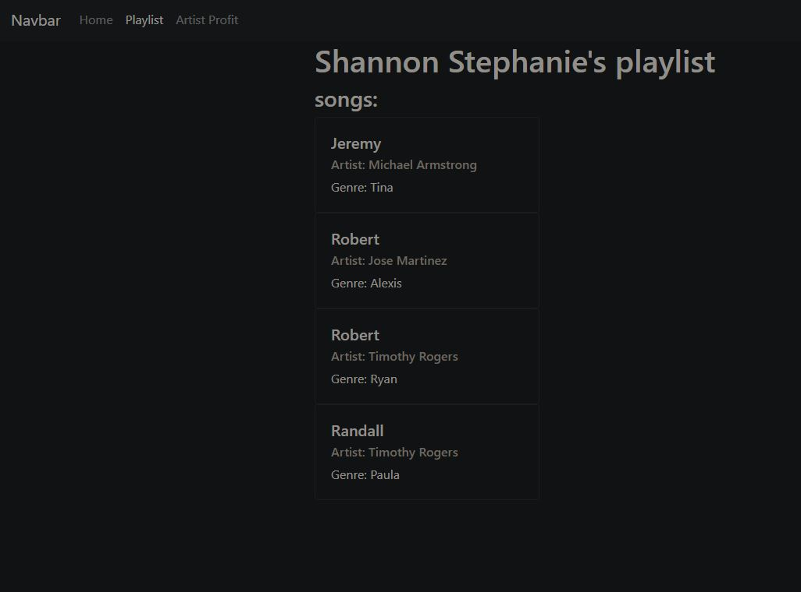

# T3A3 - Implement a System with Data and Application Layers.

##### Please note that I have Isolated the work and evidence in a seperate file. It has been copied and pasted from the README and is still availble in the README.

#####  GITHUB address: https://github.com/ScottBurleighHeads/ScottMalone_T3A3.git

This program is a class assessment completed to progress in my course. This is not a fully functioning deployable application. Time was limited so the program is made up of components to complete the requirements of the assessment only.

This assessment is a python server-side web application that takes advantage of the flask framework and its components to build a web application. It is inspired by spotify and I have tried to build a database to represent the main components that I think spotify would have as illustrated in the diagram below.

### Endpoints API:

begin with: localhost:5000/user

|Endpoint|Application|
|---|---|
|/|Query all saved data for all users|
|/login|Login into the server and get a JWT token|
|/id|Find details on the user with the matching ID|
|/create|Creates a new user|
|/update/id|Update details of the user matching the ID|
|/delete/id|Delete a user|

##### Tracks:

begin with: localhost:5000/tracks

|Endpoint|Application|
|---|---|
|/|Get all tracks|

##### Playlist:

begin with localhost:5000/tracks

|Endpoint|Application|
|---|---|
|/id|Get the playlist of the user with the id number|
|/add_track|Add tracks to your personal playlist. You will need to be signed in with a JWT token|
|/delete_track|Remove the track from the playlist|

##### Artist:

begin with localhost:5000/artist

|Endpoint|Application|
|---|---|
|/Highest_profit|Find the artist with the highest profit|
|/Lowest_profit|Find the artist with the lowest profit|
|/Average_profit|Find the average profit of all the artist|
|/Sum_profit|Sum all the profit of all the artist|
|/Ordering|Application|
|/filtering|Finds all the artist that earn less then $40 million|
|/id/Albums|Find all the albums that the artist created|
|/id/Tracks|Find all the tracks that the artist created|

##### Albums:

begin with localhost:5000/albums

|Endpoints|Application|
|---|---|
|/id|Get all information in the database related to the album|
|/update/id|Update the details of the album with the matching id number|
|/id/tracks|Get all tracks that are on the album|

### Installation instructions:

##### Set up the environment:

|Instruction|commands|
|---|---|
|clone the program from github|https://github.com/ScottBurleighHeads/ScottMalone_T3A3.git|
|Enter working directory in the terminal |cd ScottMalone_T3A3|
|Update all the latest apt packages |sudo apt-get update|
|Install python |sudo apt-get python3.8|
|update pip|Sudo apt install python3-pip|
|Install python virtual environment|sudo apt-get install python3|
|Set up virtual environment|source venv/bin/activate|
|Install requirements|pip install -r requirements.txt|
|Set up flask env variables|export FLASK_APP=main.py|
|Set up flask env variables|export FLASK_ENV=development|
|Install the database|flask db create|
|Drop all the tables|flask db drop|
|Start the flask server|flask run|

##### Set up Postgres server and database

|Instruction|Commands|
|---|---|---|
|Install postgres|sudo apt-get install posgresql-13|
|start the postgres server|sudo service postgresql start|
|login|psql postgres|
|if login fails then |sudo -i -u postgres|
|then login|psql postgres|
|create a database t3a3 in the postgres raw sql|CREATE DATABASE t3a3;|
|Optional load table and fake fake data into the database|psql t3a3 < dump.sql|

If you already have your own SQL application that is fine. Remember to create a database name t3a3 then follow the command in setup environment. You will need to set up the you DB_URI environment variable. Here is example DB_URI=postgresql+psycopg2://{Your admin}:{Your password}@localhost:5432/t3a3.

##### Flask commands

Flask:

|Instruction|Commands|
|---|---|---|
|start virtual environment|source "venv/bin/activate"|
|Create the database tables|flask db create|
|Delete all database tables|flask db drop|
|To seen the database with fake data|flask db seed|

# T3A3 - Implement a System with Data and Application Layers.

### R2) Produces a professional report that provides an analysis of privacy and security concerns relating to a system.

##### Privacy and security concerns:

Security is protecting data where as privacy is protecting the users identity. People in cybersecurity often follow the CIA triad model which assist cyber security specialist's to think about the different parts of information security. The CIA model has three parts. Confidentiality, Integrity and Availability.

##### Confidentiality: 

Enforcing access levels through Authorization and Authentification. This may involve sorting information into certain access areas for different Authorisation levels. 

In this application there were more then one layer of protection to protect the privacy and confidentiality of its users. These methods were:

- login: Username and password  
- Bcrypt: Encrypting the passwords so there not visible in clear site and protecting against brute force hacks.
- Tokens: JWT tokens to authenticate the users and Authorise access.

The user in this application will need to sign up before logging into the system. The personal details will be saved on a postgresql database where the root user postgres and authorised data administrator Scott can access the database. They have personal passwords that are greater then 16 characters to prevent brute force attacks. 

When the users create there password when signing up the password will be displayed as a hash generated by bcrypt technology which is the main technology to protect against brute force attacks. Bcrypt has built in algorithms that significantly slows the speed of which a brute force hack can be performed therefore making brute force attacks fairly obsolete. The bcrypt technology has a parameter named 'salt' which means that as technology grows in power the salt parameter can adjust to compensate against the new power. Since the passwords are hashed if there was a hack through brute force or sql injection which resulted in personal data accessed, personal passwords are still safer therefore access to other information systems by the hacker will be more difficult. Even Authorised personnel could not read clear passwords. The main reason to hash passwords is because people like to use the same password for everything. Example below:

##### Integrity:

Integrity is protecting data from deletion or modification from potential hackers. Furthermore if someone authorised makes a change it can be reversed. Integrity of a program is to protect it against hackers that may use SQL injection or other methods to access data. Data needs to be correct, authentic and reliable.

In this application the program can be reversed if an error has been made by someone Authorised by using version control. This program use's git where verions of the program are saved regularly after achieving milestones. Furthermore the program is push to a third party called github. These versions can be accessed online or locally.

Flask has it owns built-in security protocals. The first security protocal is declaring the type of HTTP request in the app.routes. This will restrict the type of data that a user can input into the system. For example a GET request will only allow a user to see data and not send data as set in methods. Restricting data access minimises the vulnerabilties of a buffer overflow or sql injection. Flask also has it own functions that query data. Using raw sql is another vulnerability that can be used for SQL-injections. It is adviced that queries be made with functions using the ORM model approach rather the raw sql in a string statement.

Another method of protecting data integrity is through tokens and cookies. In our program JWT tokens are given to users when logging in. The current setting to the token is 1 day. What that means is once the user authenticates who they are through username and password they will have authorisation to navigate through the website for one day until they need to log in again. Otherwise the user would need to log in every time a new page is open. In the application a user can create a personal playlist. Anyone can access there playlist and view the tracks but only the user who created the playlist can add tracks or delete tracks. So it was required to only Authorise the user who created the playlist to make changes to the playlist. This is where one method of using the JWT token can be used to implement Authorisation. The program matches the token with a user in the database given access to the playlist. Then changes can be made. This restricted unauthorised changes to personal playlists. 

An add on feature to flask is Marshmallo. Marshmallo is used for serialisation and deserialisation primarily but considering that marshmallo handles the input and output of data it has an extra feature. That is to validate input from the user. Marshmallo can validate the type of data as particular to an email or date or simply a string or and integer. In this application we used all four data type validations and used them in combination with restricting the length of characters or range of integers. Marshmallo has its own invalid responses if the data is not correct. Validating is checking the accuracy and quality of source data. Also limiting the data will resist buffer overflows.

##### Availability:

Availabilty talks about the need to ensure data is accessible at all times. This may be related to the hardware availablility. What can be done if there is a power failure, hardware failures and respond to upgrades. This program is only currently available on a local system. In deployment it would be recommended to deploy the application on the cloud that has multiple sources of hardware and backups.

### R3) Produces a professional report which discusses professional, ethical and legal obligations relating to a system.

Users dont normally consider that they need to trust companies with there personal information. They assume that there data is safe. In fact the opposite is happening and companies are constantly monitoring user activities so they can sell there data or select advertising that the users might be interested in without the user even knowing. As an admin, where or when is it ethically ok to stop collecting someones data. Where do they draw the line? So some ethical issues of the internet are privacy, confidentiality and anonymity. Not all methods of collecting data have the intentions to make profit. In some cases collecting data may be essential for solving major health issues. For example tracking people who have spread covid 19. Other reason may be an organisation wants to improve its product to the client. Is it ethically ok to collect the data from the user to find out which demographic they should focus on? A professional obligation would be to notify the users that there data will be collected if they choose to proceed. That means they need to consent to their data being collected. Some other ethical considerations may be whether a company should monitor emails and out going signals to protect intellectual property. There seems to be a grey area with ethics where what may seem ok for one company may not be ok for another company. An article from the Australian Privacy foundation suggest that a user only give details relevant to the request and fill the gaps in with 'unnecessary' if they feel uncomfortable.

The Australian government has a Privacy act 1988 which was introduced to promote and protect the privacy of individuals. 

Policies summarised:

- APP 1: Organistations need to be transparent and expressed with a privacy policy
- APP 2: Users need to have the option not to identify themselves or using a pseudonym
- APP 3: Organisations need to outline when information is solicited
- APP 4: Outlines how organisations must deal with unsolicited information
- APP 5: Outlines circumstances in which an organisation needs to tell people about certain situations
- APP 6: Outlines circumstances in which an organisation may use or disclose information
- APP 7: Certain conditions need to be met before used for marketing
- APP 8: Outlines steps to protect information before disclosing overseas
- APP 9: Government related circumstances.
- APP 10: The organisation has to ensure the data they collect and disclose is accurate
- APP 11: An organisation has an obligation to protect personal information and to destroy or de-identify if necessary.
- APP 12: Individuals need to have the ability to gain access to their information 
- APP 13: An organisation has an obligation to change or update personal information

So to implement the requirements of the privacy act into this application I will need the user upon registration to read and acknowledge a privacy policy that will have in the policy how I will collect and use their data. Disclose any information of their data to where it will be sent. Outline steps to protect their personal information and to destroy or de-identify the users data if there was a breach of any of the security protocals. That would be a quick overview to meet some or all the legal obligations. I would think to get professional legal advice before implementing the privacy policy. There are many different laws, some new and relevant to social media but it is definitly out of the scope of this app.

The privacy act is only for large business's that bring in $3 million or more per year. In saying that most small business that earn less then that still opt into the privacy act to protect there business's as a matter of best practices. Benefits to the company could be improved consumer confidence and trust in their operations.

##### Reference:

OAIC. (2019). Australian Privacy Principles quick reference. [online] Available at: https://www.oaic.gov.au/privacy/australian-privacy-principles/australian-privacy-principles-quick-reference/.

### R4) Uses programming language features or frameworks to implement a data model.

Please take note that a MVC data model was implemented where the model talks to postgresql database, the view renders templates covering the front end of the app and the controller combines and directs the data to where it needs to go. SQLAlchemy was used to communicate with the database. No raw sql was used in the commands to avoid sql injection. The add on feature Marshmallo was used to serialize/deserialize data and to validate data.

Example of marshmallo validating the user data. Also navigate to schemas:

### R5) Implement code using a Python framework to create, read, update and delete records, and export all data from the database from the database.

Check controllers/User_controller for a full crud resource. Check controllers/Playlist_controller to check that has a create, read and delete feature. Check controllers/Album_controller for create, read and update.

### R6) Uses programming language features or frameworks to display data

I have designed a template for the playlist display at controllers/Playlist_controllers for the endpoint localhost:5000\playlist\id. Also check templates/layout.html and templates/playlist.html. I am using fake data that inputs first names for the data so try not to get confused.

Evidence:

### R7) Implements application layer which utilises a database to produce aggregated data relating to business matters

Check controllers/Artist_controller.

Endpoints: 

Start with localhost:5000/artist

|Endpoints| Output |
|---|---|
|/Highest_profit| Finds the highest paid artist using the MAX function |
|/Lowest_profit| Finds the lowest paid artist using the MIN function | 
|/Average_profit| Finds the average profit of all artists using the average function|
|/Sum_profit| Adds all the profit of all the artists using the sum function|

### R8) Implements input validation and integrity checks on data to address business risks

Marshmallo handles the serialization and deserialization of the data meaning it is the first feature to work with the input data from the user making it ideal to validate the data input. Developers have considered this already and developed a library of validation tools built into marshmallo which I have used to validate the input. For example I have defined that email = ma.Email(required = True). That means that email needs to be formatted like and email, it also means it does not except null values as given in the insomnia example and the field is required so the user can not leave it blank when submitting that endpoint. Marshmallo even has its own invalid messages seen in the example below.

address: schemas/User_schema

 

Insomnia example:

### R9) Analyses a problem scenario and creates database tables and fields

##### One to One example:

Look in models/User_table.py and models/Alias_table.py.

I created a one to one table between User_tables and Alias_table purely to meet the requirements of the assessment. I create the link in flask shell in the example below.

##### One to Many example:

Look in models/Artist_table, models/Albums_table, models/Tracks_table

I have designed a database of artist, albums and tracks. In my design I have made a One artist to Many albums relationship, a One artist to Many tracks and a One album to Many tracks relationship.

Below is the controller endpoints for models/Artist_controller. In the functions the queries call the artist with the matching id then display all albums or all track relating to that artist.

Results of the controller endpoints displaying all albums related to artist with id=1 and all tracks to artist with id=1. Take note all Output I have just used fake names.

##### Many to Many relationship example: Bonus marks

address: models/playlist

I needed five tables to meet the requirement so I added a playlist table that is the bridge between Users to Tracks. Many Users can have Many tracks.
Endpoints:

Begin with: 

localhost:5000/playlist

|Endpoints|Purpose|
|---|---|
|/id |Get the playlist of a user with correct id|
|/add_track|Add a track to the users playlist|
|/delete_track|Delete a track from the users playlist|

### R10) Develops complex queries which select, filter, group and order data.

all query's can be found in /controllers/Artist_controller clearly  labelled 1/3, 2/3 or 3/3.

|query|type|
|---|---|
|artist_name = Artist.query.filter_by(gross_worth=max_pay).first() | selection filter |
|ordering =  Artist.query.order_by(Artist.gross_worth.desc()).all()| ordering descending order |
|filtering = Artist.query.filter((Artist.gross_worth < 40000000)).all()| filtering by gross_worth magnitude|

### R11) Develops complex queries which join tables together.

Below is a picture of raw sql in the postgresql terminal. I joined three tables together. I match the playlist table with the name of the user and the name of the track they displayed.

Below is another raw sql query where I joined another three tables together. Currently I have joined up the artist table with the albums table and the tracks table. Both the albums and the tracks belong to the artist. Please take into consideration that I just seeded all the names with first_name.faker().

Below is an example of joining artists and tracks using SQLAlchemy. The formatting is not as nice but it hopefully fulfills any requirements. Completed in the flask shell.

### R12) Implements a script to export all data from the database.

Script: check dump.sql in directory SCOTTMALONE_T3A3 to find the evidence;

pg_dump --no-owner t3a3 > dump.sql           ( Save everything on a database to a sql file for transporting )
psql {new database} < dump.sql		         ( Load into new database )

